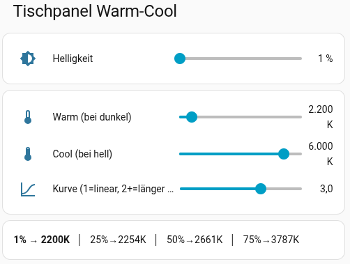

# ha-dim-to-warm

Dim-to-warm light control for Home Assistant -- dim like halogen: dark = warm white, bright = cool white, with adjustable curve.



## Concept

Halogen and incandescent bulbs naturally get warmer when dimmed. LED panels with tunable white can't do this on their own. This solution replicates that behavior through Home Assistant:

- **Dark** → warm white (e.g. 2200K, candlelight)
- **Bright** → cool white (e.g. 6000K, daylight)
- **Adjustable curve** -- exponent controls how long the light stays in the warm range

### Curve behavior

Color temperature is calculated using a power function:

```
kelvin = warm + ((brightness / 100) ^ exponent) * (cool - warm)
```

| Exponent | Behavior |
|---|---|
| 1.0 | Linear (even rise) |
| **2.0** | **Quadratic (halogen feel, recommended)** |
| 3.0 | Cubic (stays warm even longer) |
| 4.0 | Very long warm, steep rise at the end |

Example with exponent 2.0, warm=2000K, cool=6000K:

| Brightness | Color temperature |
|---|---|
| 1% | 2000K |
| 25% | 2250K |
| 50% | 3000K |
| 75% | 4250K |
| 100% | 6000K |

## Requirements

- Home Assistant
- Zigbee light with color temperature support (e.g. Gledopto, IKEA TRÅDFRI WS)
- Optional: IKEA TRÅDFRI 5-button remote for physical control
- Optional: [niro1987 ZHA Blueprints](https://github.com/niro1987/homeassistant-config) for the 5-button remote

## Setup

### 1. Input number helpers

Add to `configuration.yaml`:

```yaml
input_number:
  dim_to_warm_brightness:
    name: Brightness
    min: 1
    max: 100
    step: 1
    unit_of_measurement: "%"
    icon: mdi:brightness-6
  dim_to_warm_warm_kelvin:
    name: Warm (min)
    min: 2000
    max: 4000
    initial: 2000
    step: 100
    unit_of_measurement: "K"
    icon: mdi:thermometer-low
  dim_to_warm_cool_kelvin:
    name: Cool (max)
    min: 3000
    max: 6500
    initial: 6000
    step: 100
    unit_of_measurement: "K"
    icon: mdi:thermometer-high
  dim_to_warm_curve:
    name: Curve
    min: 1.0
    max: 4.0
    initial: 2.0
    step: 0.5
    icon: mdi:chart-bell-curve-cumulative
```

### 2. Automation

Add to `automations.yaml`:

```yaml
- id: 'dim_to_warm'
  alias: Dim-to-Warm
  description: "Dim = warm, bright = cool (power curve)"
  triggers:
  - trigger: state
    entity_id:
    - input_number.dim_to_warm_brightness
    - input_number.dim_to_warm_warm_kelvin
    - input_number.dim_to_warm_cool_kelvin
    - input_number.dim_to_warm_curve
  actions:
  - action: light.turn_on
    target:
      entity_id: light.YOUR_LIGHT_HERE    # <-- adjust!
    data:
      brightness_pct: "{{ states('input_number.dim_to_warm_brightness') | int }}"
      color_temp_kelvin: >-
        
        
        
        
        
        {{ (warm + t * (cool - warm)) | round(0) | int }}
  mode: restart
```

### 3. Dashboard card

```yaml
type: vertical-stack
title: Dim-to-Warm
cards:
  - type: entities
    entities:
      - entity: input_number.dim_to_warm_brightness
        name: Brightness
  - type: entities
    entities:
      - entity: input_number.dim_to_warm_warm_kelvin
        name: Warm (at low)
      - entity: input_number.dim_to_warm_cool_kelvin
        name: Cool (at high)
      - entity: input_number.dim_to_warm_curve
        name: Curve (1=linear, 3=halogen)
  - type: markdown
    content: >-
      
      
      
      
      
      
      **{{ pct | int }}%** → **{{ kelvin }}K**
```

### 4. Optional: IKEA 5-button remote

Using the [Custom 5-Button Blueprint](https://github.com/niro1987/homeassistant-config/blob/master/blueprints/automation/niro1987/zha_ikea_tradfri_5button_remote_custom.yaml):

```yaml
- id: 'dim_to_warm_remote'
  alias: Dim-to-Warm Remote
  use_blueprint:
    path: niro1987/zha_ikea_tradfri_5button_remote_custom.yaml
    input:
      remote: YOUR_REMOTE_DEVICE_ID    # <-- adjust!
      power_short:
      - action: light.toggle
        target:
          entity_id: light.YOUR_LIGHT_HERE    # <-- adjust!
      dimup_short:
      - action: input_number.set_value
        target:
          entity_id: input_number.dim_to_warm_brightness
        data:
          value: "{{ [states('input_number.dim_to_warm_brightness') | float + 5, 100] | min }}"
      dimup_long:
      - repeat:
          while: []
          sequence:
          - action: input_number.set_value
            target:
              entity_id: input_number.dim_to_warm_brightness
            data:
              value: "{{ [states('input_number.dim_to_warm_brightness') | float + 2, 100] | min }}"
          - delay:
              milliseconds: 50
      dimdown_short:
      - action: input_number.set_value
        target:
          entity_id: input_number.dim_to_warm_brightness
        data:
          value: "{{ [states('input_number.dim_to_warm_brightness') | float - 5, 1] | max }}"
      dimdown_long:
      - repeat:
          while: []
          sequence:
          - action: input_number.set_value
            target:
              entity_id: input_number.dim_to_warm_brightness
            data:
              value: "{{ [states('input_number.dim_to_warm_brightness') | float - 2, 1] | max }}"
          - delay:
              milliseconds: 50
```

**Long-press note:** The infinite loop (`repeat: while: []`) is automatically stopped by the blueprint's `mode: restart` when the button is released (new ZHA event).

**Minimum brightness note:** With `min: 1` on the input number, the light never turns off when dimming down -- it stays at the lowest level. This prevents accidental turn-off while dimming.

## Tuning tips

- **Exponent 2.0** is closest to the halogen feel
- **Warm endpoint**: 2000K for deep candlelight, 2700K for classic warm white
- **Cool endpoint**: 4000K for subtle daylight, 6000K for full range
- **Long-press speed**: 50ms delay at 2% steps gives smooth, analog-feeling dimming. Short press at 5% for quick jumps.

## License

MIT
